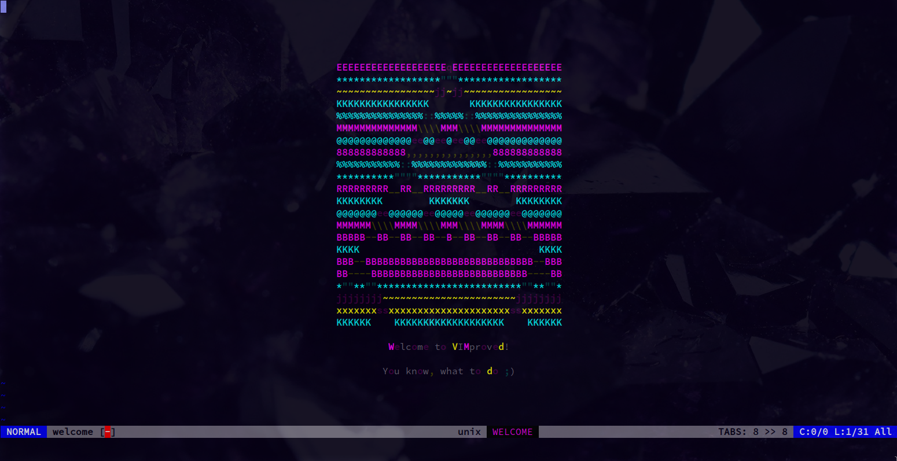

# ca-1d

Elementary cellular automata CLI, written in C.

I use this Vim welcome screen art:



Control display by providing parameters:

```bash
Usage:
        ./build/release/ca-1d --help
        ./build/release/ca-1d --rule=[0-255] --width=[1-1000] --height=[1-1000] --map_alive=C... --map_dead=C... --map_frequency=program|line|cell
        ./build/release/ca-1d --rule=[0-255,;|...] --width=[1-1000,;|...] --height=[1-1000,;|...] --map_alive=C... --map_dead=C... --map_frequency=program|line|cell
        ./build/release/ca-1d --rule=r --width=r --height=r --map_alive=C... --map_dead=C... --map_frequency=r
```

You can provide range of numeric values or list of values to choose (but not both) for `rule`, `width` and `height`.

`map_alive` and `map_dead` parameters accept one or more symbols for displaying CA state.

If more than one given, choosing pair of symbols at the same index from both options. Longer option
is truncated to match shorter option length.

You can control, how frequently symbols are randomized with `map_frequency` parameter, which accepts values:

    - `program` - symbols are chosen once
    - `line` - symbols are different for each line
    - `cell` - choose random symbol for each cell (total mess, unless you colorize it)

You can also provide `r` value for `rule`, `width` and `height` to randomize value with default range (`0-255` or `1-1000`).

Parameter `map_frequently` can be randomized with `r` value too.

## Building

This builds in `release` mode:

```bash
make clean && make
```

Then run:

```bash
./build/ca-1d ...your options
```

To build in `debug` mode:

```bash
make clean && make debug
```
