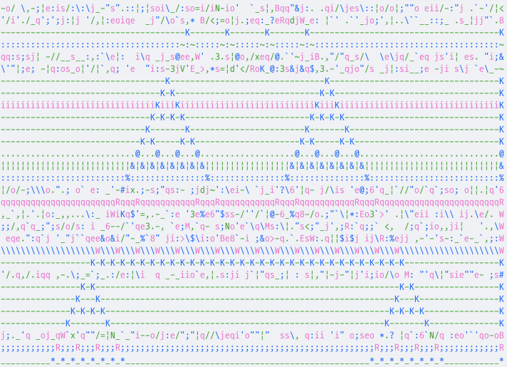

# ca-1d

Elementary cellular automata CLI, written in C.

## Update

I've decided to cut down functionality to just printing cellular automata state in 0's and 1's.

## Usage

```text
Usage:
	build/release/ca-1d --help
	build/release/ca-1d --rule=[0-255] --width=[1-1000] --height=[1-1000]
```

## Example

```bash
echo "00100" | build/release/ca-1d --rule=60 --width=10 --height=inf | head -n 4
```

Result:

```text
0010000000
0011000000
0010100000
0011110000

```

`STDIN` is not required.

Example usage is showed in animated Python [script](./examples/animation.py):



## Installing

This installs binary to system:

```bash
sudo make clean install
```

Now, you can run:

```bash
ca-1d ...your options
```

To uninstall run:

```bash
sudo make uninstall
```

## Building

This builds in `release` mode:

```bash
make clean && make
```

Then run:

```bash
./build/release/ca-1d ...your options
```

To build in `debug` mode:

```bash
make clean && make debug
```

Then debug, using GDB:

```bash
gdb --args ./build/debug/ca-1d ...your options
```

## Development

If encounter bugs or want to improve the project,
feel free to post an issue or submit PR :sunglasses:
